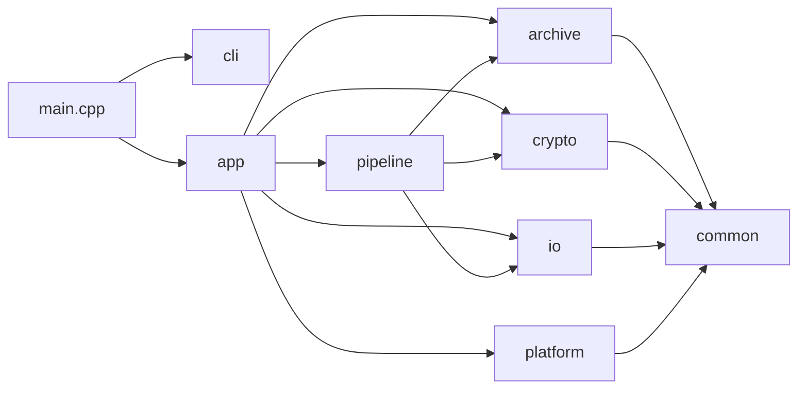
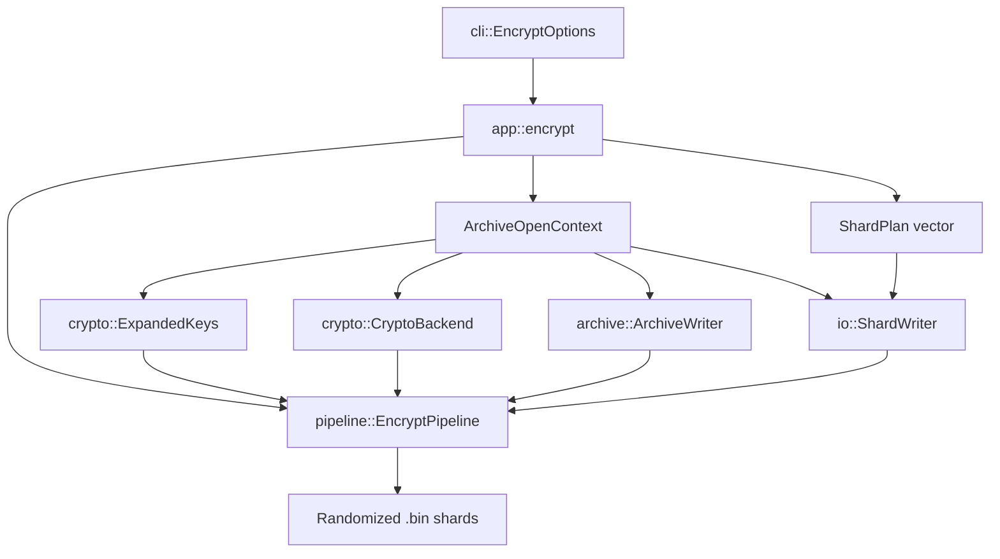
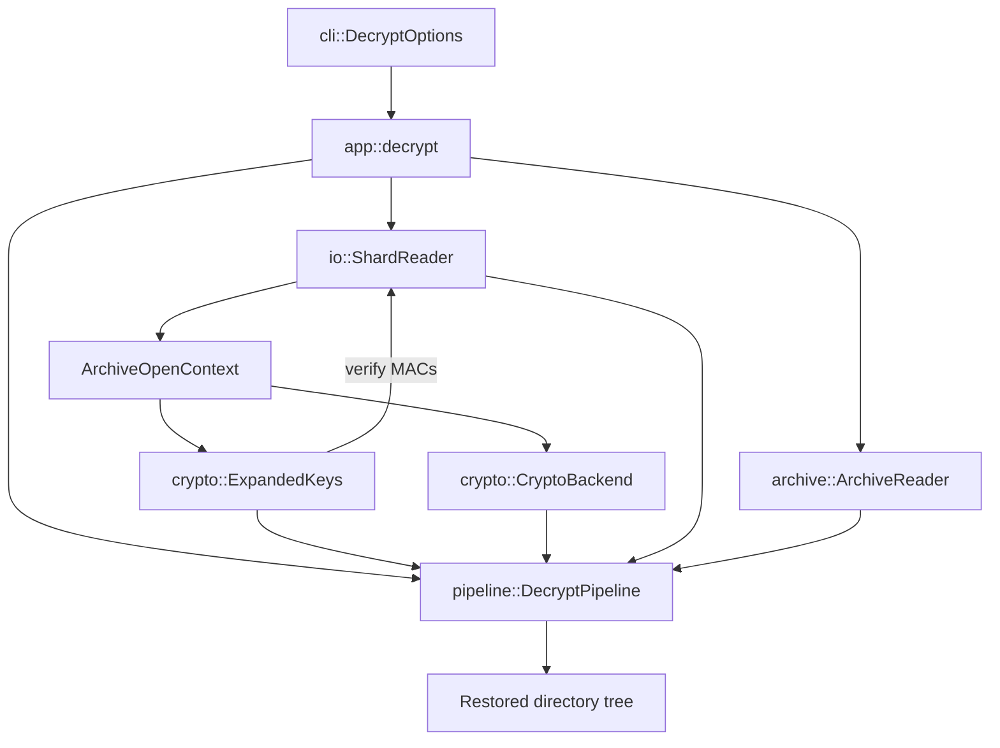
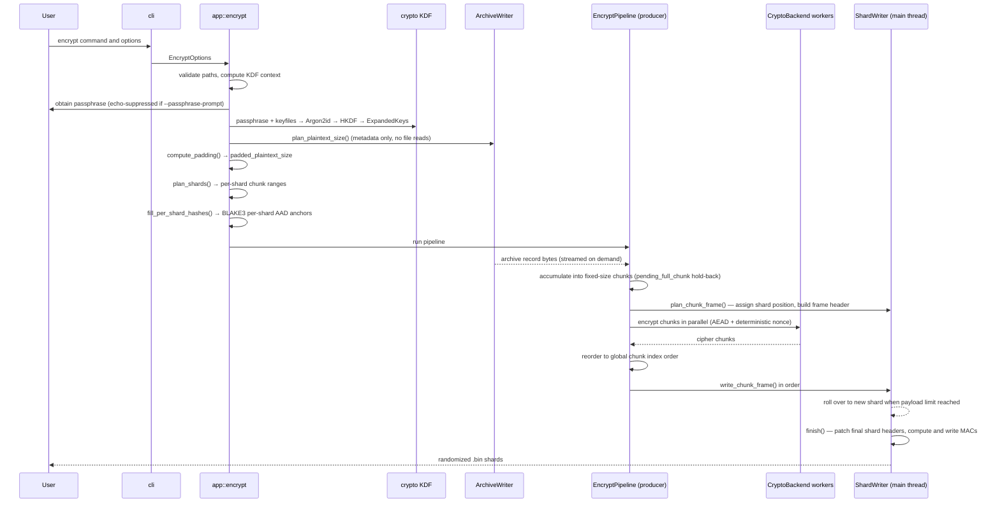
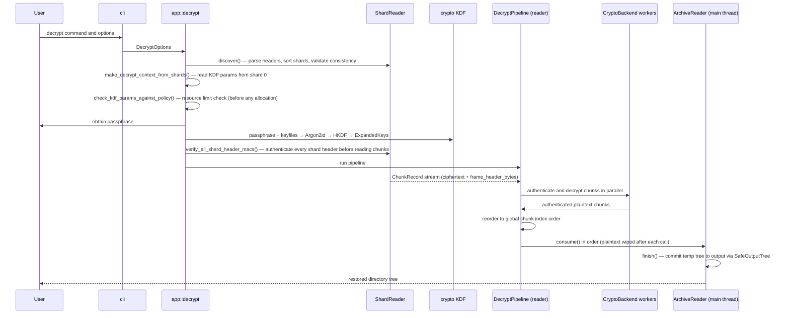

# BSEAL High-Level Design — Current Implementation State

**Repository location:** `docs/HIGH_LEVEL_DESIGN.md`  
**Document status:** Current-state design overview  
**Audience:** maintainers, contributors, reviewers, and future security auditors  
**Scope:** high-level implementation design; module responsibilities; important classes; data-flow overview  
**Out of scope:** source-code reference manual, line-by-line API documentation, detailed cryptographic proof, and complete binary format specification

For cryptographic detail see `docs/CRYPTOGRAPHY.md`. For the binary format specification see `docs/FORMAT.md`.

---

## 1. Purpose

This document describes the current high-level design of the BSEAL C++ implementation. It is intended to complement, not replace, the security rationale and the format specification.

The goal of this document is to answer the following questions:

- what the project currently does;
- which modules exist and why;
- which classes and data structures are most important;
- how those classes relate to each other;
- how data flows during encryption and decryption;
- which parts are settled, and which remain open concerns.

This document avoids line-by-line API documentation. It uses class and module names where they are necessary for a useful design overview, but it does not attempt to document every method or internal implementation detail.

---

## 2. Current Implementation Summary

BSEAL is a C++20 command-line application for sealing a directory tree into randomized binary shard files and later restoring it with the same passphrase and required keyfiles.

The current state includes:

- command-line parsing for encryption and decryption;
- an application orchestration layer for `encrypt` and `decrypt` operations;
- AEAD encryption backends for XChaCha20-Poly1305 (default) and AES-256-GCM;
- key derivation using passphrases, optional keyfiles, Argon2id, HKDF-SHA-256, and domain-separated expanded keys;
- an archive layer that represents directories, regular files, symlinks, file bytes, metadata, archive begin/end records, and random padding records;
- a hardened POSIX file-extraction backend (`SafeOutputTree`) that uses `openat`/`mkdirat`/`fstatat`/`renameat` to resist TOCTOU symlink attacks during restore;
- an I/O layer for writing and reading `.bin` shard files with authenticated public headers;
- a pipeline layer that chunks archive records, encrypts or decrypts chunks, and coordinates worker threads;
- platform utilities for randomness, CPU features, and memory handling;
- unit-style and black-box regression tests covering round trips, incorrect secrets, corruption, missing shards, duplicate shards, and overwrite behaviour.

The BSEAL-F1 format is **frozen** and normative (see `docs/FORMAT.md`). The implementation is not yet suitable for protecting real secrets; external cryptographic and implementation review has not been completed.

The primary remaining open concerns are:

- completing external cryptographic and implementation review;
- audit of the POSIX-hardened extraction backend under adversarial conditions;
- formal review of padding effectiveness against size-leakage analysis;
- compatibility policy and migration procedures for future format versions.

---

## 3. Design Boundaries

BSEAL is organized around four major transformations:

1. **Filesystem to archive records**  
   The input directory tree is converted into a logical archive record stream.

2. **Archive records to plaintext chunks**  
   The serialized record stream is split into bounded plaintext chunks.

3. **Plaintext chunks to authenticated encrypted frames**  
   Each chunk is encrypted and authenticated independently using the selected AEAD backend.

4. **Encrypted frames to shard files**  
   Frames are written into randomized `.bin` shard files with public interpretation data.

Decryption reverses this flow:

1. discover and parse shard files;
2. read the public header from the shard with `shard_index == 0`;
3. derive keys from the supplied passphrase and keyfiles;
4. verify all shard header MACs before reading any chunk data;
5. authenticate public headers and encrypted frames;
6. decrypt frames into plaintext chunks;
7. concatenate chunks into an archive record stream;
8. parse records and restore the directory tree safely.

The design intentionally separates these responsibilities so that cryptography, archive semantics, physical storage, CLI parsing, and pipeline orchestration can be reviewed independently.

---

## 4. Module Map

The current source tree is organized around the following modules.

| Module | Main responsibility | High-level role |
|---|---|---|
| `main.cpp` | Thin executable entry point | Parses arguments, dispatches to app layer, maps exceptions to exit codes |
| `app/` | Application orchestration | Connects CLI options, key derivation, crypto backend selection, archive reader/writer, shard reader/writer, and pipelines |
| `cli/` | Command-line model and parsing | Converts user arguments into structured encryption/decryption options |
| `crypto/` | Cryptographic operations | Provides AEAD backends, KDF logic, key expansion, secure buffers, and crypto-related types |
| `archive/` | Logical archive model | Converts filesystem trees to/from archive records; serializes metadata and file bytes; sanitizes restore paths; provides POSIX-hardened extraction |
| `io/` | Physical shard I/O | Writes and reads `.bin` files, chunk frames, shard headers, and payload streams |
| `pipeline/` | Concurrent processing | Moves data through producer, worker, and ordered writer/consumer stages |
| `platform/` | OS and hardware helpers | Provides secure randomness, CPU feature detection, and memory-locking support |
| `common/` | Shared foundation | Defines byte types, spans, errors, size parsing, checked arithmetic, and endian utilities |
| `tests/` | Validation | Contains unit-style tests and black-box CLI regression tests |

---

## 5. Top-Level Control Flow

At a high level, BSEAL follows this dependency direction:



`main.cpp` remains thin. Operational complexity belongs in `app/`, while low-level transformations remain in their respective modules. The pipeline layer is the only module that has knowledge of all three domains (crypto, archive, I/O), because it coordinates data movement across them.

---

## 6. Important Classes and Data Structures

### 6.1 Entry Point and Application Layer

| Class or structure | Module | Purpose |
|---|---|---|
| `cli::EncryptOptions` | `cli/` | Structured representation of encryption CLI arguments: input/output paths, suite, KDF preset, chunk size, shard size, padding policy, keyfiles |
| `cli::DecryptOptions` | `cli/` | Structured representation of decryption CLI arguments: input/output paths, overwrite flag, keyfiles, `KdfResourcePolicy`, hardened extraction mode |
| `cli::PaddingPolicy` | `cli/` | Holds a `PaddingPolicyKind` (`None`, `Chunk`, `Power2`, `FixedSize`) and the optional target size for `FixedSize` mode |
| `cli::Command` | `cli/` | Selected top-level command: `Help`, `Encrypt`, or `Decrypt` |
| `cli::ParsedArgs` | `cli/` | Container returned by `parse_args()`; holds the selected command and both option structs |
| `app::encrypt` | `app/` | Free function; application-level encryption orchestration |
| `app::decrypt` | `app/` | Free function; application-level decryption orchestration |

The application layer also defines several internal types inside the anonymous namespace of `BsealApp.cpp` that are central to the encrypt/decrypt sequence but are not part of the public API:

| Internal type | Purpose |
|---|---|
| `ArchiveOpenContext` | Bundles archive-level context shared by KDF, pipeline, and shard I/O: `suite`, `kdf_params`, `kdf_salt`, `archive_id`, `chunk_plain_size`, and the populated `GlobalPublicHeaderV1` |
| `ShardPlan` | Per-shard pre-computed layout: `shard_index`, `first_chunk_index`, `chunk_count`, `payload_len`, and `public_header_hash`. Computed before any file content is encrypted, so per-shard hashes are known and can be embedded in AEAD AAD upfront |
| `PaddingResult` | Result of `compute_padding()`: target plaintext size, policy ID, and policy value to write into the global header |

**Passphrase acquisition.** The `obtain_passphrase()` helper reads a passphrase from `stdin`. Without `--passphrase-prompt`, it reads one line (no echo suppression, intended for pipe usage). With `--passphrase-prompt`, it prompts twice with echo suppressed via POSIX `termios` and confirms the two entries match before continuing. The passphrase is immediately moved into a `SecureBuffer` and the intermediate `std::string` is wiped with `secure_wipe_string()`.

### 6.2 Cryptography Layer

| Class or structure | Module | Purpose |
|---|---|---|
| `crypto::CryptoBackend` | `crypto/` | Abstract interface: `encrypt_chunk` and `decrypt_chunk`. Callers supply key, nonce, plaintext/ciphertext, and `ChunkAad`. The interface hides whether the suite is XChaCha20-Poly1305 or AES-256-GCM |
| `crypto::XChaCha20Poly1305Backend` | `crypto/` | XChaCha20-Poly1305 AEAD via libsodium `crypto_aead_xchacha20poly1305_ietf_*` |
| `crypto::AesGcmBackend` | `crypto/` | AES-256-GCM AEAD via OpenSSL `EVP_aes_256_gcm()` |
| `crypto::KdfInput` | `crypto/` | All inputs to `derive_master_seed()`: passphrase (UTF-8 string), keyfile paths, 32-byte `salt`, 32-byte `archive_id`, `KdfParams` |
| `crypto::KdfParams` | `crypto/` | Argon2id parameters: `memory_kib`, `iterations`, `parallelism`, `output_bytes`, and a `KdfPreset` tag |
| `crypto::KdfPreset` | `crypto/` | Enum: `Fast` (256 MiB / 3 / 4), `Strong` (1 GiB / 3 / 4), `Paranoid` (2 GiB / 4 / 8), `Custom` |
| `crypto::KdfResourcePolicy` | `crypto/` | Decrypt-side runtime cap on Argon2id cost. Checked before the KDF is invoked to prevent attacker-controlled resource exhaustion. Defaults cover the Paranoid preset |
| `crypto::ExpandedKeys` | `crypto/` | Four domain-separated 32-byte `SecureBuffer` fields: `chunk_encryption_key`, `manifest_key`, `header_authentication_key`, `nonce_derivation_key` |
| `crypto::NonceContext` | `crypto/` | Holds `CipherSuite` and `archive_id`; passed to `derive_chunk_nonce()` |
| `crypto::SecureBuffer` | `crypto/` | Non-copyable RAII byte buffer; wipes backing allocation with `sodium_memzero` on destruction |
| `crypto::ChunkAad` | `crypto/` | Spans pointing to `public_header_hash` (32 bytes) and serialized `ChunkFrameHeaderV1` (40 bytes); serialized by `serialize_chunk_aad_v1()` before being passed to the AEAD backend |
| `crypto::CipherSuite` | `crypto/` | Enum: `XChaCha20Poly1305 = 1`, `Aes256Gcm = 2`; values are stable across format versions |

The key schedule separates roles — chunk encryption, manifest protection, header authentication, and nonce derivation — so that the same derived bytes are never reused for unrelated security purposes. See `docs/CRYPTOGRAPHY.md` §4 for the full derivation chain.

### 6.3 Archive Layer

| Class or structure | Module | Purpose |
|---|---|---|
| `archive::ArchiveWriter` | `archive/` | Traverses the input directory tree and emits serialized archive records on demand. `plan_plaintext_size()` computes the total from filesystem metadata (no file content read). `set_trailing_padding_record()` registers the pre-built padding record. `next_record_bytes()` streams the record sequence. `bytes_produced()` tracks total emitted bytes for post-run verification |
| `archive::ArchiveWriterOptions` | `archive/` | Input root, chunk size hint (drives internal file-bytes payload size), `preserve_timestamps`, `preserve_permissions`, `include_symlinks` |
| `archive::ArchiveReader` | `archive/` | Consumes authenticated plaintext bytes from the pipeline (`consume()`) and restores filesystem objects. `finish()` verifies `ArchiveEnd`, promotes temp files into the output root, and cleans up temporary state |
| `archive::ArchiveReaderOptions` | `archive/` | Output root, `overwrite_existing`, `restore_timestamps`, `restore_permissions`, `allow_symlinks`, and `hardened_extract_mode` |
| `archive::ArchiveRecord` | `archive/` | A record type tag plus a payload byte vector |
| `archive::RecordType` | `archive/` | `ArchiveBegin`, `DirectoryEntry`, `FileEntry`, `FileBytes`, `FileEnd`, `SymlinkEntry`, `ArchiveEnd`, `RandomPadding` (values 1–8) |
| `archive::EntryMetadata` | `archive/` | Filesystem metadata to preserve: path (with portable `/` separators), size, permissions, timestamps, symlink target |
| `archive::PathSanitizer` | `archive/` | `is_safe_relative_path()` rejects `..` components and absolute paths. `make_safe_output_path()` combines the output root with a sanitized archive-relative path |
| `archive::SafeOutputTree` | `archive/` | Platform abstraction for safe extraction. **Hardened POSIX backend** (Linux/macOS): traverses path components via `openat`/`mkdirat`/`fstatat(AT_SYMLINK_NOFOLLOW)`, promotes files via `renameat(2)` — fully TOCTOU-safe. **Portable backend**: uses `std::filesystem` plus canonical-path symlink escape check — not TOCTOU-safe. Selected by `HardenedExtractMode` |
| `archive::HardenedExtractMode` | `archive/` | Enum: `Auto` (use hardened if available, else portable), `On` (require hardened; fail if unavailable), `Off` (always portable) |

**Record serialization format** (defined by `RecordFormat.hpp`):

```
uint8  record_type
uint64 payload_size (little-endian)
byte[payload_size] payload
```

`kRecordPrefixSize = 9` bytes. This constant is used by the padding logic: a padding gap smaller than 9 bytes cannot hold a valid `RandomPadding` record, so the padding target is bumped to the next feasible boundary. File bytes are streamed as individual `FileBytes` records with a maximum payload of 1 MiB each, so even very large files do not require unbounded buffering.

The archive layer treats filenames, directory structure, file sizes, symlink targets, and metadata as plaintext that must enter the encrypted domain. The physical `.bin` shard layout does not expose the original filesystem structure.

### 6.4 I/O Layer

| Class or structure | Module | Purpose |
|---|---|---|
| `io::GlobalPublicHeaderV1` | `io/` | 192-byte global public header at the start of every shard file. Contains: magic (`BSEAL-F1`), format version, algorithm IDs (`aead_alg_id`, `kdf_alg_id`, `hash_alg_id`, `mac_alg_id`), `archive_id`, `kdf_salt`, Argon2id parameters, `chunk_plain_size`, `shard_count`, `global_chunk_count`, `padded_plaintext_size`, `final_plaintext_chunk_len`, padding policy, and `max_shard_payload_len`. All integer fields are little-endian |
| `io::ShardPublicHeaderV1` | `io/` | 80-byte per-shard public header following the global header in every shard file. Contains: shard magic (`BSEAL-S1`), `shard_index`, `first_global_chunk_index`, `shard_chunk_count`, `shard_payload_len`, and `header_mac` (32-byte HMAC-SHA-256) |
| `io::ChunkFrameHeaderV1` | `io/` | 40-byte per-chunk public header. Contains: `frame_flags` (including `kChunkFrameFlagFinalChunk`), `shard_index`, `global_chunk_index`, `plaintext_len`, `ciphertext_len`, `tag_len`. Serialized as the second component of the AEAD AAD and written immediately before the ciphertext+tag in the shard file |
| `io::ChunkRecord` | `io/` | Return type of `ShardReader::read_next_chunk_record()`. Carries `chunk_index`, `shard_index`, `plaintext_size`, `frame_flags`, the exact 40 serialized `frame_header_bytes` (used as AEAD AAD), and the `ciphertext` (ciphertext + tag) |
| `io::ShardInfo` | `io/` | Describes one discovered shard file: `path`, `global_header`, `shard_header`, pre-computed `public_header_hash`, and `file_size`. Convenience accessors: `shard_index()`, `first_chunk_index()`, `chunk_count()`, `shard_payload_len()` |
| `io::ShardReaderValidation` | `io/` | Optional cross-shard consistency checks: `suite_id`, `archive_id`, `chunk_plain_size`, `public_header_hash`. Any non-`nullopt` field is verified against every shard during `validate_shards()` |
| `io::ShardWriter` | `io/` | Writes encrypted frames into randomized `.bin` shard files. `plan_chunk_frame()` assigns a frame its position and computes the serialized 40-byte header. `write_chunk_frame()` appends the header bytes and ciphertext+tag to the current shard file, rolling over to a new shard when the payload limit is reached. `finish()` closes and patches the final shard headers with accurate counts. `abort_and_remove_created_shards_noexcept()` removes only the files created by this instance |
| `io::ShardWriterOptions` | `io/` | Output directory, `max_shard_payload_len`, filename extension, fully-populated `GlobalPublicHeaderV1`, `header_authentication_key` (moved in as `SecureBuffer`, wiped on destruction), and `per_shard_public_header_hashes` (pre-computed vector indexed by shard index) |
| `io::PlannedChunkFrame` | `io/` | Result of `plan_chunk_frame()`: `ShardWritePosition` (shard index, record offset, chunk index), populated `ChunkFrameHeaderV1`, and serialized header bytes |
| `io::ShardWritePosition` | `io/` | The three-field address of a frame within the archive: `shard_index`, `record_offset`, `chunk_index` |
| `io::compute_public_header_hash` | `io/` | BLAKE3-256 hash of the global and shard headers (with `header_mac` zeroed) under the domain label `"BSEAL public header hash v1\0"`. Included in the AEAD AAD of every chunk in that shard, cryptographically binding each ciphertext to its header context. See `CRYPTOGRAPHY.md` §5 |
| `io::compute_shard_header_mac` / `io::verify_shard_header_mac` | `io/` | HMAC-SHA-256 under `header_authentication_key` over `"BSEAL header mac v1\0" || global_header || shard_header_with_zero_mac`. Verified in constant time via `CRYPTO_memcmp`. See `CRYPTOGRAPHY.md` §6 |
| `io::AsyncReader` | `io/` | Worker-pool-based asynchronous file reader. Exists as a complete implementation but is **not used by the current production pipeline** (ShardReader uses synchronous `std::ifstream`). Provided for future I/O-overlap optimization |
| `io::AsyncWriter` | `io/` | Worker-pool-based asynchronous file writer. Same status as `AsyncReader` — implemented but not wired into the current pipeline |
| `io::BufferPool` | `io/` | Reusable byte buffer pool. Exists but is **not used by the current production pipeline** |

The I/O layer owns the physical representation of encrypted data on disk. It does not understand the meaning of file metadata or plaintext archive records. Its job is to store and retrieve authenticated encrypted frames and public interpretation data safely and consistently.

### 6.5 Pipeline Layer

| Class or structure | Module | Purpose |
|---|---|---|
| `pipeline::EncryptPipeline` | `pipeline/` | Owns the full encryption run. Accepts `EncryptPipelineOptions`, a `CryptoBackend`, `ExpandedKeys`, an `ArchiveWriter`, and a `ShardWriter`. `run()` launches all threads and blocks until completion or failure |
| `pipeline::EncryptPipelineOptions` | `pipeline/` | `chunk_plain_size`, `worker_count` (0 = hardware concurrency), `queue_depth` (0 = `worker_count * 2`), `archive_id`, `per_shard_public_header_hashes` (indexed by shard index), fallback `public_header_hash`, `emit_final_chunk_when_empty`, `expected_plaintext_bytes` (validates that `ArchiveWriter` produced the planned byte count) |
| `pipeline::DecryptPipeline` | `pipeline/` | Owns the full decryption run. Accepts `DecryptPipelineOptions`, a `CryptoBackend`, `ExpandedKeys`, a `ShardReader`, and an `ArchiveReader` |
| `pipeline::DecryptPipelineOptions` | `pipeline/` | `chunk_plain_size`, `worker_count`, `queue_depth`, `archive_id`, `per_shard_public_header_hashes`, fallback `public_header_hash`, `padded_plaintext_size` (verified against total decrypted bytes at the end) |
| `pipeline::WorkQueue<T>` | `pipeline/` | Bounded MPMC blocking queue with `push()` / `pop()` / `close()`. `push()` blocks while the queue is full (backpressure). `pop()` blocks while empty and drains after `close()`. Both pipelines use two instances of this queue |
| `pipeline::detail::FailureState` | `pipeline/` | Thread-safe first-exception capture shared across all pipeline threads. Stores the first `std::exception_ptr` via `record()`. Other threads check `failed()` to terminate early. `rethrow_if_failed()` is called after all threads join |

**Internal pipeline types (not part of the public API).**  
`PlainChunk` and `CipherChunk` are defined in the anonymous namespaces of `EncryptPipeline.cpp` and `DecryptPipeline.cpp`. They carry chunk index, frame header, serialized header bytes, and plaintext/ciphertext bytes between pipeline stages. They are implementation details hidden behind the `run()` interface.

**Thread structure — encryption pipeline:**

```
Thread 1: producer_main()
    ArchiveWriter.next_record_bytes()
    → accumulates into fixed-size chunks (pending_full_chunk trick for final-chunk detection)
    → ShardWriter.plan_chunk_frame()       (reserves position and builds frame header)
    → WorkQueue<PlainChunk>.push()

Thread 2..N+1: encryption_worker_main()   (N = resolved worker count)
    WorkQueue<PlainChunk>.pop()
    → derive_chunk_nonce()
    → CryptoBackend.encrypt_chunk()
    → WorkQueue<CipherChunk>.push()

Thread N+2: worker_joiner
    waits for all N workers to finish
    → closes WorkQueue<CipherChunk>

Main thread: ordered_writer_main()
    WorkQueue<CipherChunk>.pop()
    → reorders via std::map<uint64_t, CipherChunk>
    → ShardWriter.write_chunk_frame() in global chunk index order
    → ShardWriter.finish()
```

**Thread structure — decryption pipeline:**

```
Thread 1: reader_main()
    ShardReader.read_next_chunk_record()
    → WorkQueue<CipherChunk>.push()

Thread 2..N+1: decryption_worker_main()   (N = resolved worker count)
    WorkQueue<CipherChunk>.pop()
    → derive_chunk_nonce()
    → CryptoBackend.decrypt_chunk()        (throws AuthenticationFailed on tag failure)
    → WorkQueue<PlainChunk>.push()

Thread N+2: worker_joiner
    waits for all N workers to finish
    → closes WorkQueue<PlainChunk>

Main thread: ordered_plaintext_consumer_main()
    WorkQueue<PlainChunk>.pop()
    → reorders via std::map<uint64_t, Bytes>
    → ArchiveReader.consume() in global chunk index order
    → ArchiveReader.finish()
    → verify total bytes == padded_plaintext_size
```

In both pipelines the main thread performs the last serial stage (ordered writing or ordered consuming). This minimises thread count: a 4-core machine uses 4 worker threads + 1 producer/reader + 1 joiner + 1 main-thread stage.

All workers share a single `CryptoBackend` instance by reference. This is safe because libsodium and OpenSSL's `EVP` functions are stateless per-call — all state lives on the stack within each call.

### 6.6 Platform and Common Layers

| Class or structure | Module | Purpose |
|---|---|---|
| `platform::fill_secure_random` / `platform::secure_random_bytes` | `platform/` | CSPRNG wrappers: `getrandom(2)` on Linux, `BCryptGenRandom` on Windows, `arc4random_buf` on BSD/macOS. Used for `archive_id`, `kdf_salt`, padding bytes, and shard filenames |
| `platform::random_filename_stem` | `platform/` | Generates a random filename stem with ≥192 bits of entropy. No path separators or characters that require escaping |
| `platform::random_base62_string` | `platform/` | Generates a random base62 string (0-9, a-z, A-Z) using rejection sampling for unbiased output |
| `platform::CpuFeatures` | `platform/` | Struct: `aes_ni`, `pclmulqdq`, `avx2`, `avx512f`, `vaes`, `neon`. `detect_cpu_features()` queries CPUID or equivalent. Used for crypto backend selection diagnostics |
| `platform::LockedMemoryRegion` | `platform/` | RAII wrapper for `mlock(2)` + `MADV_DONTDUMP`. Prevents a memory region from being swapped and excludes it from core dumps. Lock failure is non-throwing; `locked()` reports success. Currently not applied to `SecureBuffer` backing allocations (known limitation) |
| `common::Error` and subclasses | `common/` | `Error` (base, exit 1), `InvalidArgument` (bad input, exit 1), `AuthenticationFailed` (AEAD/MAC failure, exit 3). All inherit from `std::exception` |
| `common::Types` | `common/` | `Byte` (`uint8_t`), `Bytes` (`std::vector<Byte>`), `ByteSpan` (`std::span<Byte>`), `ConstByteSpan` (`std::span<const Byte>`) |
| `common::CheckedArithmetic` | `common/` | Overflow-safe integer operations: `checked_add_u64`, `checked_mul_u64`, `checked_ceil_div_u64`, `checked_next_power_of_two_u64`, `checked_int_size`, `checked_ull_size`. Used throughout the app, pipeline, and I/O layers to prevent integer overflow in size calculations |
| `common::Endian` | `common/` | `append_u64_le`, `append_u32_le`, `append_u16_le` helpers for canonical little-endian serialization |
| `common::SizeParser` | `common/` | Parses human-readable size strings such as `16M`, `4G` for CLI options |

---

## 7. Relationship Between Major Objects

The application layer constructs and connects objects rather than doing the whole operation itself.

For encryption:



For decryption:



---

## 8. Encryption Data Flow

Encryption converts a directory tree into one or more randomized `.bin` shard files.

### 8.1 Inputs

Encryption begins with:

- an input directory;
- an output directory;
- a passphrase from the terminal or stdin (with optional echo suppression and double-entry confirmation via `--passphrase-prompt`);
- zero or more keyfiles (passphrase-only mode is valid);
- an AEAD suite selection (`--suite`);
- a KDF preset (`--kdf-preset`);
- a chunk size (`--chunk-size`, default 16 MiB);
- a shard size (`--shard-size`, default 4 GiB);
- a padding policy (`--padding`, default `power2`).

### 8.2 App Setup

The application layer performs all setup before the pipeline starts. The sequence is:

1. Validate input directory and keyfile paths.
2. Create output directory if needed.
3. Construct `ArchiveOpenContext`: select suite, resolve KDF preset to `KdfParams`, generate random 32-byte `archive_id` and `kdf_salt`, set `chunk_plain_size`. Begin filling `GlobalPublicHeaderV1`.
4. **Early sanity check:** verify that one full-size chunk frame fits within the configured shard size. Fails fast before the expensive Argon2id call.
5. Obtain passphrase; derive `ExpandedKeys` (`derive_expanded_keys()` internally calls Argon2id then HKDF-SHA-256; all intermediate values are wiped on completion).
6. Construct `ArchiveWriter` and call `plan_plaintext_size()` — a metadata-only traversal that counts serialized bytes without reading file content.
7. Apply the selected padding policy (`compute_padding()`) to produce `padded_plaintext_size`. If padding is needed, build the `RandomPadding` record from CSPRNG bytes and register it with `set_trailing_padding_record()`.
8. Compute `global_chunk_count` and `final_plaintext_chunk_len`; fill the remaining `GlobalPublicHeaderV1` fields.
9. Run `plan_shards()` to distribute chunks across shards: builds a `ShardPlan` vector with each shard's index range, payload length, and first chunk index.
10. Run `fill_per_shard_hashes()`: for each shard plan, construct its tentative `ShardPublicHeaderV1`, then compute `public_header_hash = BLAKE3(...)`. These hashes are finalized **before encryption starts** so that every worker can embed the correct hash into AEAD AAD from the first chunk.
11. Construct `ShardWriter` (moves the `header_authentication_key` into it) and `EncryptPipeline`.
12. Call `pipeline.run()`. If it throws, call `abort_and_remove_created_shards_noexcept()` to clean up all shard files written so far, then rethrow.

### 8.3 Archive Serialization

`ArchiveWriter::next_record_bytes()` returns one record at a time:

```
ArchiveBegin record (contains kArchiveFormatVersion = 1)
For each entry in the input directory (pre-sorted):
    DirectoryEntry record  (if directory)
    FileEntry record + one or more FileBytes records (≤1 MiB payload each) + FileEnd record  (if regular file)
    SymlinkEntry record  (if symlink and include_symlinks=true)
ArchiveEnd record
RandomPadding record  (if set_trailing_padding_record() was called)
```

As file content is streamed, the writer tracks how many bytes have been read per file (`current_file_bytes_read_`). At `FileEnd`, it validates that the read count matches the file size captured at plan time. A size mismatch (file grew or shrank between planning and reading) throws immediately. After the pipeline completes, `expected_plaintext_bytes` in the pipeline options ensures `bytes_produced()` equals the planned padded size.

Filenames, paths, file sizes, symlink targets, and metadata are never written to the public shard header. They enter the encrypted domain as archive records.

### 8.4 Chunk Formation

`producer_main()` inside `EncryptPipeline` accumulates archive record bytes into fixed-size plaintext chunks. A key implementation detail is the **pending_full_chunk** hold-back:

- When a chunk fills to exactly `chunk_plain_size`, it is held in `pending_full_chunk` rather than pushed immediately.
- When the next chunk starts filling, the held-back chunk is pushed as a non-final chunk.
- When the archive is exhausted, if there is a partial current chunk, it is pushed as the final chunk. If the current chunk is empty and a full pending chunk exists, the pending chunk is pushed as final.
- If both are empty and `emit_final_chunk_when_empty` is true, one empty chunk is pushed as final.

This means the final-chunk flag is always set on exactly one chunk, without requiring lookahead into the archive record stream.

Before pushing, the producer calls `ShardWriter::plan_chunk_frame()`, which assigns the chunk's shard position, builds the `ChunkFrameHeaderV1`, and serializes it to 40 bytes. The serialized header bytes travel with the chunk through the pipeline so that workers can include them verbatim in the AEAD AAD.

The chunking boundary is intentionally independent of file boundaries. This prevents external observers from inferring individual file sizes from the shard layout.

### 8.5 Parallel Encryption

Each encryption worker runs `encryption_worker_main()`:

1. Pop a `PlainChunk` from the encrypt queue.
2. Derive the unique deterministic nonce: `derive_chunk_nonce(nonce_derivation_key, {suite, archive_id}, chunk_index)`.
3. Construct `ChunkAad` from the shard's `public_header_hash` and the 40-byte serialized `ChunkFrameHeaderV1`.
4. Call `CryptoBackend::encrypt_chunk()` with `{key, nonce, plaintext, aad}`. The output is `ciphertext || 16-byte tag`.
5. Verify the output length matches `ChunkFrameHeaderV1.ciphertext_len + tag_len`. Mismatch is treated as an internal error.
6. Wipe the plaintext bytes (`detail::wipe_bytes()`).
7. Push a `CipherChunk` carrying the index, frame header, and ciphertext+tag to the write queue.

All workers share a single `CryptoBackend&`. This is safe because both libsodium and OpenSSL's EVP functions are stateless per invocation — all internal state is on the stack within the function call.

### 8.6 Ordered Writing

`ordered_writer_main()` runs on the main thread (not a separate thread):

- Pops `CipherChunk` items from the write queue.
- Reorders using a `std::map<uint64_t, CipherChunk>` keyed by chunk index.
- Flushes consecutive complete chunks to `ShardWriter::write_chunk_frame()` in order.
- Rejects stale chunks (`index < next_expected_index`) and duplicate chunks (already in the map).
- After the queue closes, any remaining pending chunks indicate missing output from workers — this is treated as an error.
- On success, calls `ShardWriter::finish()`.

### 8.7 Shard Writing

`ShardWriter` maintains an open `std::ofstream` to the current shard file. For each frame:

1. Append the 40-byte serialized `ChunkFrameHeaderV1` to the file.
2. Append the `ciphertext || tag` bytes.
3. Accumulate payload length and chunk count for the current shard.
4. If the next chunk would exceed `max_shard_payload_len`, close the current shard and open a new one with a randomly generated filename.

When a shard is closed, `rewrite_shard_header()` seeks back to byte 192 (where `ShardPublicHeaderV1` begins) and rewrites it with the final `shard_chunk_count` and `shard_payload_len`. At this point, the HMAC-SHA-256 `header_mac` is also computed and written.

Shard filenames are generated by `platform::random_filename_stem()` with ≥192 bits of entropy. They encode no information about the archive contents, ordering, size, or timestamps.

If the pipeline fails for any reason, `abort_and_remove_created_shards_noexcept()` removes all `.bin` files created by this `ShardWriter` instance. Pre-existing files in the output directory are never touched.

### 8.8 Encryption Flow Diagram



---

## 9. Decryption Data Flow

Decryption converts one or more `.bin` shard files back into a directory tree.

### 9.1 Inputs

Decryption begins with:

- an input directory containing `.bin` shards;
- an output directory;
- a passphrase from the terminal or stdin;
- zero or more keyfiles (must match what was used during encryption, in the same order);
- overwrite policy (`--overwrite`);
- optional KDF resource policy overrides (`--max-kdf-memory`, `--max-kdf-iterations`, `--max-kdf-parallelism`);
- hardened extraction mode (`--hardened-extract`, default `auto`).

Unlike encryption, the cryptographic suite, KDF parameters, salt, archive identifier, and chunk size are read from the archive's public header. Those values must be treated as untrusted until the `header_mac` is verified.

### 9.2 App Setup

The sequence is:

1. Validate input and keyfile paths; check output directory policy.
2. `ShardReader::discover(input_dir)` — scans for `.bin` files, parses `GlobalPublicHeaderV1` and `ShardPublicHeaderV1` from each, computes `public_header_hash`, validates consistency (duplicate indices, gaps, archive ID mismatch), and sorts shards by `shard_index`.
3. `make_decrypt_context_from_shards()` — reads KDF parameters, suite, `kdf_salt`, `archive_id`, and `chunk_plain_size` from shard 0's global header.
4. `check_kdf_params_against_policy()` — checks the archive's Argon2id parameters against the runtime resource policy. **This check runs before any allocation or crypto call.** This prevents a malicious archive with enormous memory parameters from exhausting resources.
5. Obtain passphrase; derive `ExpandedKeys`.
6. `verify_all_shard_header_macs()` — verifies the HMAC-SHA-256 `header_mac` in every shard's `ShardPublicHeaderV1` against the derived `header_authentication_key`, using constant-time comparison. **All shard headers are authenticated before any chunk data is read.** A single MAC failure throws `AuthenticationFailed` immediately.
7. Build `per_shard_hashes` vector (shard_index → public_header_hash) from the already-verified `ShardInfo` objects.
8. Construct `ShardReader` (moves `header_authentication_key` into it; header MACs are re-verified by the reader on open for defence-in-depth), `ArchiveReader` (with `SafeOutputTree` inside, using the selected extraction mode), and `DecryptPipeline`.
9. Call `pipeline.run()`.

### 9.3 Shard Reading

`ShardReader::discover()` is fully header-driven. It does not rely on file names for ordering. The shard order, chunk ranges, and inter-shard consistency are determined from the authenticated header fields:

- `shard_index` must cover `[0, shard_count-1]` with no gaps or duplicates;
- all shards must share the same `archive_id`, `aead_alg_id`, and `chunk_plain_size`;
- shard chunk ranges must be contiguous and non-overlapping when sorted by `first_global_chunk_index`.

`read_next_chunk_record()` iterates through shards in index order, streaming `ChunkRecord` objects. Each `ChunkRecord` carries the exact 40 serialized `frame_header_bytes` that must be re-created as AEAD AAD during decryption.

`ShardReader` tracks a `std::set<uint64_t> seen_chunk_indices_` and a `saw_final_chunk_` flag to detect duplicate or out-of-range chunks during streaming.

### 9.4 Parallel Decryption

Each decryption worker runs `decryption_worker_main()`:

1. Pop a `CipherChunk` from the decrypt queue.
2. Derive the nonce identically to encryption: `derive_chunk_nonce(nonce_derivation_key, {suite, archive_id}, chunk_index)`.
3. Reconstruct `ChunkAad` from the shard's `public_header_hash` and the original 40-byte `frame_header_bytes` read verbatim from disk.
4. Call `CryptoBackend::decrypt_chunk()`. This verifies the AEAD tag atomically before returning any plaintext. On tag failure, `AuthenticationFailed` is thrown — no plaintext is returned.
5. Verify that `plaintext.size() == plaintext_size` from the frame header. This is a post-authentication consistency check, not an unauthenticated trim.
6. Push `PlainChunk{index, plaintext}` to the plaintext queue.

A failed authentication may indicate any of: wrong passphrase, wrong keyfile, wrong keyfile order, corrupted shard, modified header or frame, or unsupported algorithm interpretation. All are treated identically as `AuthenticationFailed` (exit code 3). The system does not attempt best-effort recovery.

### 9.5 Ordered Plaintext Reconstruction

`ordered_plaintext_consumer_main()` runs on the main thread, mirroring the encrypt writer:

- Reorders plaintext chunks via `std::map<uint64_t, Bytes>`.
- Calls `ArchiveReader::consume()` for each ready chunk in order.
- Wipes each chunk's bytes after `consume()` returns.
- After the queue closes, calls `ArchiveReader::finish()`.
- Verifies `total_plaintext_bytes == padded_plaintext_size` (from the public header, which has been authenticated). A mismatch indicates an encryptor bug or archive corruption.

### 9.6 Archive Restoration

`ArchiveReader::consume()` buffers partial records internally. When a complete record is available, it dispatches to record-specific handlers:

- `ArchiveBegin` — validates the format version.
- `DirectoryEntry` — creates the directory under a temporary subtree (`temp_root_`). Directory metadata (timestamps, permissions) is deferred until all children are written (to avoid permission modes that would block child creation).
- `FileEntry` — opens a new temp file under `temp_root_`; records expected size.
- `FileBytes` — writes bytes to the open temp file.
- `FileEnd` — closes the temp file; validates total bytes written matches the declared size.
- `SymlinkEntry` — creates a symlink (if `allow_symlinks` is set).
- `ArchiveEnd` — marks end of archive records.
- `RandomPadding` — silently discarded.

`ArchiveReader::finish()` is called only after all chunks have been authenticated and consumed:

1. Verifies `ArchiveEnd` was seen.
2. Applies deferred directory metadata.
3. Calls `SafeOutputTree::rename_into()` for each file, promoting it from `temp_root_` into the final output directory. On the hardened POSIX backend this uses `renameat(2)` into a verified directory fd.
4. Cleans up `temp_root_`.

The two-phase extract-then-promote design means partial output is never visible in the output directory if decryption fails partway through.

### 9.7 Decryption Flow Diagram



---

## 10. Public, Secret, and Encrypted Data

The implementation maintains a strict distinction between public data, secret data, and encrypted payload data.

### 10.1 Public Data

Public data is visible in `.bin` files before decryption:

- magic bytes and format version;
- algorithm identifiers (`aead_alg_id`, `kdf_alg_id`, `hash_alg_id`, `mac_alg_id`);
- KDF parameters (memory, iterations, parallelism, Argon2 version);
- `kdf_salt` and `archive_id`;
- shard and frame interpretation fields (indices, counts, sizes, flags);
- `header_mac` — authenticates that the above fields have not been tampered with;
- `public_header_hash` — BLAKE3 of the public headers, embedded in chunk AAD;
- ciphertext lengths and frame sizes;
- randomized output filenames (no information leakage beyond file count and total size).

Public data that influences interpretation is authenticated by `header_mac` (shard headers) and by AEAD AAD (chunk frames).

### 10.2 Secret Data

Secret data must never be logged, serialized, or retained longer than necessary:

- passphrase;
- keyfile contents;
- `pass_key` (Argon2id output);
- `keyfile_mix` (BLAKE3 mix of keyfile digests);
- `master_seed` (HKDF-SHA-256 output);
- expanded keys: `chunk_encryption_key`, `manifest_key`, `header_authentication_key`, `nonce_derivation_key`;
- `nonce_derivation_key`-derived nonce prefixes;
- any temporary plaintext buffers containing user data or metadata.

All of these are stored in `SecureBuffer` instances or wiped with `secure_wipe_string()` / `detail::wipe_bytes()` immediately after use.

### 10.3 Encrypted Payload Data

The following are never written to public shard headers or shard filenames:

- original filenames and relative paths;
- directory tree structure;
- file contents and sizes (as embedded in archive records);
- symlink targets;
- file and directory permissions and timestamps;
- random padding content.

The archive layer is responsible for ensuring all of the above enter the encrypted record stream.

---

## 11. Error and Failure Model

The implementation uses exceptions and `FailureState` to propagate failures across concurrent pipeline stages.

**Exception hierarchy:**

| Type | Exit code | Meaning |
|---|---|---|
| `bseal::Error` | 1 | I/O error, format error, internal error |
| `bseal::InvalidArgument` | 1 | Bad arguments, validation failure, resource policy rejection |
| `bseal::AuthenticationFailed` | 3 | AEAD tag failure, MAC failure, wrong passphrase/keyfile |

**Pipeline failure propagation:**  
When any thread throws an exception, it calls `FailureState::record()` and then closes the relevant `WorkQueue`. Other threads check `FailureState::failed()` at their loop boundaries and terminate early. After all threads join, the main thread calls `FailureState::rethrow_if_failed()`, which rethrows the first captured exception. Only the first exception is preserved; subsequent exceptions from other threads are discarded.

**Important failure principles:**

- invalid arguments fail before starting the operation;
- KDF parameters from public headers are bounded before allocation;
- all shard header MACs are verified before any chunk data is read;
- authentication failure rejects the archive (exit 3);
- malformed frames reject the archive;
- missing, duplicate, stale, or reordered chunks reject the archive;
- restore path escapes (`..`, absolute paths) reject the archive;
- partial output in the temp tree is never promoted to the output directory on failure.

---

## 12. Format and Compatibility Position

The implementation follows the BSEAL-F1 format specification (`docs/FORMAT.md`), which is **frozen and normative**. Every `.bin` shard file begins with a `GlobalPublicHeaderV1` (192 bytes) and a `ShardPublicHeaderV1` (80 bytes), followed by encrypted chunk frames. Known-answer tests in `tests/io/TestFormatV1Kat.cpp` pin the serialization and hash values, preventing silent algorithm substitution.

The practical compatibility position is:

- the BSEAL-F1 format is locked; implementations must produce byte-identical output for the same inputs;
- any change that alters serialized bytes is a breaking change and must be caught by KAT tests;
- future format versions should be rejected explicitly by readers that do not support them;
- no external cryptographic audit has been completed; the implementation should not be used for real secrets.

---

## 13. Settled and Open Areas

### 13.1 Header Layer — Settled

The public header layer is security-critical. The current state:

- `GlobalPublicHeaderV1` and `ShardPublicHeaderV1` serialization is canonical, little-endian, and pinned by KAT tests.
- `compute_public_header_hash()` uses BLAKE3-256 with domain prefix `"BSEAL public header hash v1\0"` over the concatenated global and shard headers (with `header_mac` zeroed). The result is embedded in every chunk's AEAD AAD.
- `compute_shard_header_mac()` / `verify_shard_header_mac()` use HMAC-SHA-256 under the `header_authentication_key`, compared in constant time via `CRYPTO_memcmp`.
- All header authentication logic lives in `io/ShardFrame.*`. There is no legacy header layer — the former `archive::PublicHeaderAuth` compatibility wrapper was removed.
- All shard header MACs are verified before any chunk data is read.

### 13.2 Shard Discovery — Settled

Shard ordering is fully header-driven. `ShardReader::discover()` sorts by `shard_index` from the shard header. Filenames carry no ordering semantics and are not used for shard interpretation. The reader validates that the shard set is complete (no index gaps), non-duplicate, and internally consistent.

### 13.3 Padding — Settled

All four padding policies are implemented and covered by integration round-trip tests:

- `none` — no padding; plaintext size is unobfuscated.
- `chunk` — pad to the next multiple of `chunk_plain_size`.
- `power2` — pad to the next power-of-two total plaintext size.
- `fixed-size=N` — pad to exactly `N` bytes; requires `N` to be a positive multiple of `chunk_plain_size`; fails if `N < raw_size` or if the gap is too small for a `RandomPadding` record prefix (minimum 9 bytes).

Padding is applied as a single `RandomPadding` archive record filled with CSPRNG bytes, pre-built in `app::encrypt` and registered with `set_trailing_padding_record()`. Size-leakage analysis and formal review of anonymity-set guarantees have not been completed.

### 13.4 Random Filename Generation — Settled

All shard filenames come from `platform::random_filename_stem()` which calls `platform::fill_secure_random()`. There is no fallback path using non-cryptographic random sources.

### 13.5 Hardened Extraction Backend — Implemented, Not Audited

`SafeOutputTree` provides a POSIX-hardened extraction backend that eliminates TOCTOU symlink races during restore. It is selected by default (`HardenedExtractMode::Auto`) on platforms where it is available. The implementation has not been externally audited.

### 13.6 Async I/O — Implemented, Not Wired Into Production Path

`io::AsyncReader` and `io::AsyncWriter` are fully implemented worker-pool-based async I/O classes. They are not currently used by `ShardReader`, `ShardWriter`, or the pipeline. The production pipeline uses synchronous `std::ifstream` / `std::ofstream`. These classes are available for future I/O-overlap optimization.

### 13.7 Audit Status

No external cryptographic audit has been completed. The implementation should not be used to protect real secrets until review, fuzzing, TOCTOU testing, corruption testing, and format stabilization reviews are complete.

---

## 14. Documentation Map

| Document | Purpose |
|---|---|
| `docs/INCENTIVE.md` | Aspirational target-state rationale and motivation |
| `docs/HIGH_LEVEL_DESIGN.md` | This document — current implementation structure and data flow |
| `docs/FORMAT.md` | Binary format specification, serialization rules, and validation rules. Normative and frozen |
| `docs/CRYPTOGRAPHY.md` | Deep technical reference: algorithm mathematics, inputs/outputs, security properties, attack mitigations, and full key schedule |
| `docs/MAINTAINABILITY.md` | Development guidelines, refactoring conventions, and code quality standards |
| `docs/RELEASE_CHECKLIST.md` | Pre-release verification checklist |

---

## 15. Maintainer Checklist

Before treating this document as release-grade, maintainers should verify the following against the current source tree:

- all listed modules still exist with the stated responsibilities;
- `main.cpp` remains a thin dispatcher with no operational logic;
- app-level orchestration is in `app/`, not in `main.cpp`;
- CLI options match the supported behaviour;
- both AEAD backends (XChaCha20-Poly1305 and AES-256-GCM) are compiled and tested;
- KDF behaviour matches the documented key schedule in `docs/CRYPTOGRAPHY.md`;
- `GlobalPublicHeaderV1` and `ShardPublicHeaderV1` are serialized canonically;
- all shard header MACs are verified before any chunk is decrypted;
- `public_header_hash` is a BLAKE3-256 digest computed by `io::compute_public_header_hash` with the domain prefix `"BSEAL public header hash v1\0"`; pinned by KAT tests;
- shard discovery is header-driven and does not rely on filename ordering;
- chunk indices are checked for missing, duplicate, stale, and out-of-range values;
- all archive records are authenticated before restoration (through AEAD tag verification);
- path traversal and absolute restore paths are rejected by `PathSanitizer`;
- `SafeOutputTree` hardened backend rejects symlinks at any intermediate path component;
- extraction is staged to a temp tree and promoted atomically only after full authentication;
- padding behaviour matches the documented policy for all four modes;
- output shard filenames are generated using `platform::fill_secure_random()`;
- failed encryption cleans up all `.bin` output via `abort_and_remove_created_shards_noexcept()`;
- tests cover corruption, truncation, wrong secrets, missing shards, duplicate shards, reordered shards, overwrite behaviour, and all padding modes.

---

## 16. Summary

The current BSEAL design is organized around a clean separation of responsibilities:

- `cli/` understands user commands;
- `app/` assembles operations (pre-plans shard layout, derives keys, constructs all objects);
- `crypto/` derives keys and encrypts/decrypts chunks;
- `archive/` maps filesystem state to and from encrypted archive records, and handles safe extraction;
- `io/` maps encrypted frames to and from shard files with authenticated public headers;
- `pipeline/` provides concurrent throughput and ordering via a producer/workers/ordered-writer thread structure;
- `platform/` provides OS-specific support (CSPRNG, memory locking, CPU features);
- `common/` provides shared types, errors, and arithmetic.

The central data paths are:

```text
filesystem tree → archive records → plaintext chunks → AEAD frames → randomized .bin shards
```

```text
randomized .bin shards → AEAD frames → plaintext chunks → archive records → restored filesystem tree
```

The BSEAL-F1 format is frozen. The implementation has meaningful functionality and a complete end-to-end pipeline. The primary remaining work is external cryptographic review, audit of the POSIX-hardened extraction backend, and formal size-leakage analysis for the padding system.
