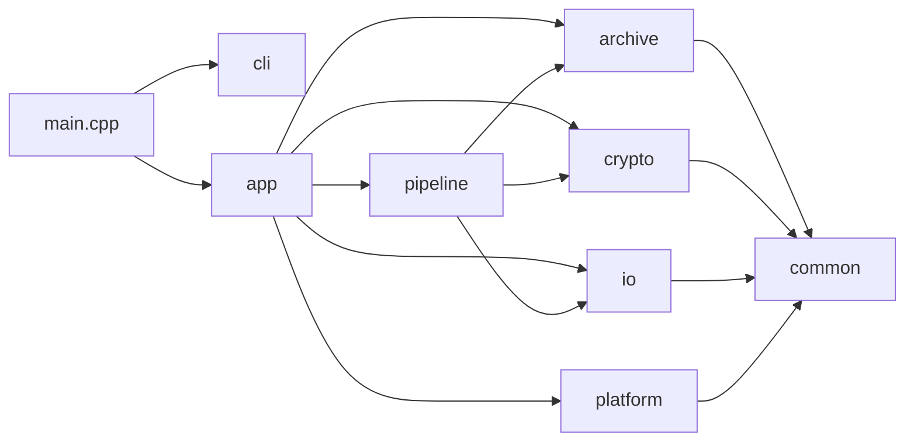
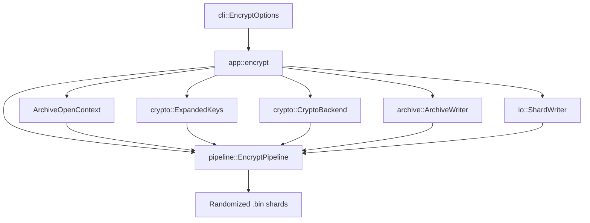
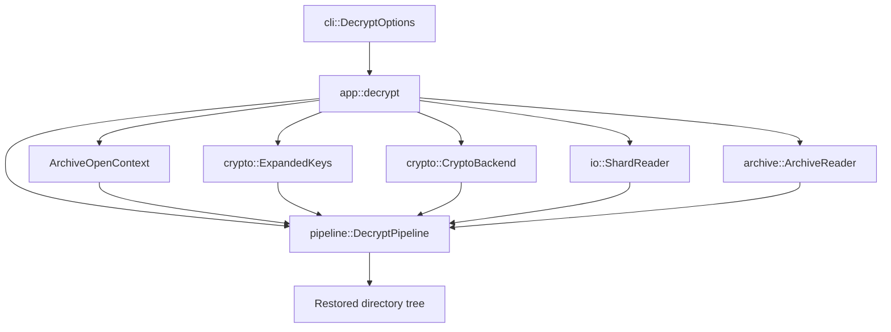
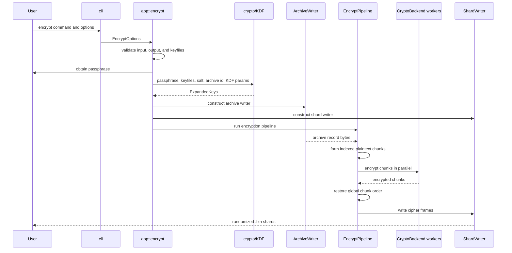
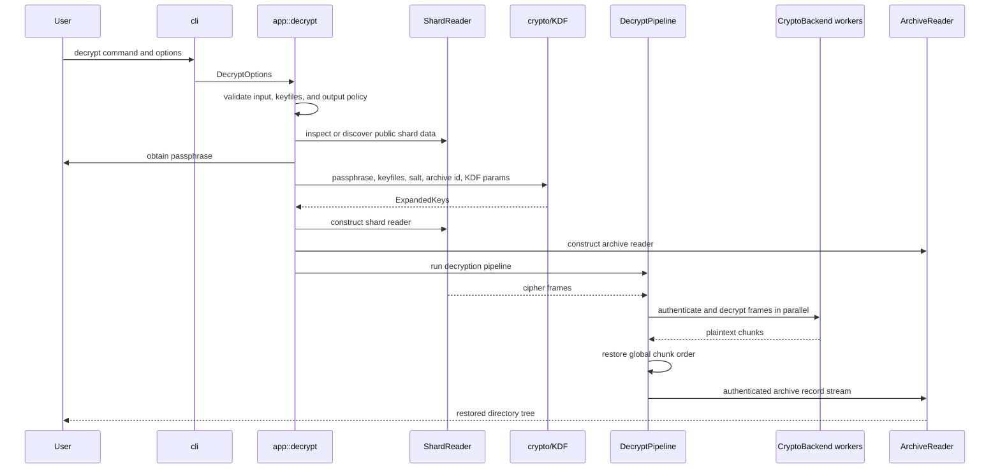

# BSEAL High-Level Design — Current Implementation State

**Repository location:** `docs/HIGH_LEVEL_DESIGN.md`  
**Document status:** Current-state design overview  
**Audience:** maintainers, contributors, reviewers, and future security auditors  
**Scope:** high-level implementation design; module responsibilities; important classes; data-flow overview  
**Out of scope:** source-code reference manual, line-by-line API documentation, detailed cryptographic proof, and complete binary format specification

---

## 1. Purpose

This document describes the current high-level design of the BSEAL C++ implementation as represented by the current repository materials and recent refactoring patches. It is intended to complement, not replace, the security rationale and the format specification.

The goal of this document is to answer the following questions:

- what the project currently does;
- which modules exist and why;
- which classes and data structures are most important;
- how those classes relate to each other;
- how data flows during encryption and decryption;
- which parts are implemented, transitional, or still unsettled.

This document intentionally avoids real source code. It uses class and module names because those are necessary for a useful design overview, but it does not attempt to document every method or internal implementation detail.

---

## 2. Current Implementation Summary

BSEAL is currently an experimental C++20 command-line application for sealing a directory tree into randomized binary shard files and later restoring it with the same passphrase and required keyfiles.

The implementation is no longer only a skeleton. The current state includes:

- command-line parsing for encryption and decryption;
- an application orchestration layer for `encrypt` and `decrypt` operations;
- AEAD encryption backends for XChaCha20-Poly1305 and AES-256-GCM;
- key derivation using passphrases, keyfiles, Argon2id, HKDF-SHA-256, and domain-separated expanded keys;
- an archive layer that represents directories, regular files, symlinks, file bytes, metadata, archive begin/end records, and random padding records;
- an I/O layer for writing and reading `.bin` shard files;
- a pipeline layer that chunks archive records, encrypts or decrypts chunks, and coordinates worker threads;
- platform utilities for randomness, CPU features, and memory handling;
- unit-style and black-box regression tests covering round trips, incorrect secrets, corruption, missing shards, duplicate shards, and overwrite behavior.

The implementation should still be treated as work in progress. It is not yet suitable for protecting real secrets. The most important unfinished or unsettled areas are:

- finalizing and auditing the public container/shard header layer;
- making shard discovery fully header-driven and authenticated;
- consolidating public-header serialization, authentication, and binding-hash logic into one canonical implementation;
- eliminating any fallback path that does not use the project cryptographic-randomness wrapper;
- defining compatibility guarantees only after the file format is stable;
- completing external cryptographic and implementation review.

---

## 3. Design Boundaries

BSEAL is organized around four major transformations:

1. **Filesystem to archive records**  
   The input directory tree is converted into a logical archive record stream.

2. **Archive records to plaintext chunks**  
   The serialized record stream is split into bounded plaintext chunks.

3. **Plaintext chunks to authenticated encrypted frames**  
   Each chunk is encrypted and authenticated independently using the selected AEAD backend.

4. **Encrypted frames to shard files**  
   Frames are written into randomized `.bin` shard files with public interpretation data.

Decryption reverses this flow:

1. discover and parse shard files;
2. derive keys from the supplied passphrase and keyfiles;
3. authenticate public headers and encrypted frames;
4. decrypt frames into plaintext chunks;
5. concatenate chunks into an archive record stream;
6. parse records and restore the directory tree safely.

The design intentionally separates these responsibilities so that cryptography, archive semantics, physical storage, CLI parsing, and pipeline orchestration can be reviewed independently.

---

## 4. Module Map

The current source tree is organized around the following modules.

| Module | Main responsibility | High-level role |
|---|---|---|
| `main.cpp` | Thin executable entry point | Parses arguments, dispatches to app layer, maps exceptions to exit codes |
| `app/` | Application orchestration | Connects CLI options, key derivation, crypto backend selection, archive reader/writer, shard reader/writer, and pipelines |
| `cli/` | Command-line model and parsing | Converts user arguments into structured encryption/decryption options |
| `crypto/` | Cryptographic operations | Provides AEAD backends, KDF logic, key expansion, secure buffers, and crypto-related types |
| `archive/` | Logical archive model | Converts filesystem trees to/from archive records; serializes metadata and file bytes; sanitizes restore paths |
| `io/` | Physical shard I/O | Writes and reads `.bin` files, cipher frames, shard headers, and payload streams |
| `pipeline/` | Concurrent processing | Moves data through producer, worker, and ordered writer/consumer stages |
| `platform/` | OS and hardware helpers | Provides secure randomness, CPU feature detection, and memory-locking support |
| `common/` | Shared foundation | Defines byte types, spans, errors, size parsing, and common utilities |
| `tests/` | Validation | Contains unit-style tests and black-box CLI regression tests |

---

## 5. Top-Level Control Flow

At a high level, BSEAL follows this dependency direction:



`main.cpp` should remain thin. The design direction is that operational complexity belongs in `app/`, while low-level transformations remain in their respective modules.

---

## 6. Important Classes and Data Structures

### 6.1 Entry Point and Application Layer

| Class or structure | Module | Purpose | Collaborators |
|---|---|---|---|
| `cli::EncryptOptions` | `cli/` | Structured representation of encryption CLI arguments | `app::encrypt`, `ArchiveWriter`, `ShardWriter`, `EncryptPipeline` |
| `cli::DecryptOptions` | `cli/` | Structured representation of decryption CLI arguments | `app::decrypt`, `ShardReader`, `ArchiveReader`, `DecryptPipeline` |
| `cli::Command` | `cli/` | Represents the selected top-level command | `main.cpp` |
| `app::encrypt` | `app/` | Application-level encryption orchestration | CLI options, crypto, archive, I/O, pipeline |
| `app::decrypt` | `app/` | Application-level decryption orchestration | CLI options, crypto, archive, I/O, pipeline |
| `ArchiveOpenContext` | `app/` | Internal context carrying suite, KDF parameters, salt, archive identifier, `GlobalPublicHeaderV1`, and chunk size | KDF, backend selection, decrypt setup |

The application layer currently performs several responsibilities that should remain carefully bounded: input validation, passphrase acquisition, keyfile validation, KDF parameter setup, backend selection, construction of archive and shard components, and pipeline invocation.

### 6.2 Cryptography Layer

| Class or structure | Module | Purpose | Collaborators |
|---|---|---|---|
| `crypto::CryptoBackend` | `crypto/` | Abstract interface for AEAD encryption and decryption | Pipeline workers |
| `crypto::XChaCha20Poly1305Backend` | `crypto/` | XChaCha20-Poly1305 AEAD implementation | `CryptoBackend`, libsodium |
| `crypto::AesGcmBackend` | `crypto/` | AES-256-GCM AEAD implementation | `CryptoBackend`, OpenSSL crypto |
| `crypto::KdfInput` | `crypto/` | Inputs to key derivation: passphrase, keyfiles, salt, archive identifier, KDF parameters | `derive_master_seed` |
| `crypto::KdfParams` | `crypto/` | Argon2id parameter set or preset-resolved KDF configuration | CLI, app, format/header handling |
| `crypto::ExpandedKeys` | `crypto/` | Domain-separated keys used by the rest of the system | Pipelines, header authentication, nonce derivation |
| `crypto::SecureBuffer` | `crypto/` | Memory container for sensitive derived material | KDF and key schedule |
| `crypto::ChunkAad` | `crypto/` | Associated data bound to chunk encryption/decryption | AEAD backends and pipeline workers |
| `crypto::CipherSuite` | `crypto/` | Internal representation of selected AEAD suite | CLI, headers, app, backend factory |

The crypto layer is intended to hide primitive-specific details behind a narrow backend interface. The pipeline should not need to know whether the selected backend is XChaCha20-Poly1305 or AES-256-GCM, except through backend properties such as key and nonce sizes.

The key schedule separates roles such as chunk encryption, manifest or metadata protection, header authentication, and nonce derivation. This separation is important because it prevents the same derived bytes from being reused for unrelated security purposes.

### 6.3 Archive Layer

| Class or structure | Module | Purpose | Collaborators |
|---|---|---|---|
| `archive::ArchiveWriter` | `archive/` | Converts an input directory tree into serialized archive records; `plan_plaintext_size()` computes the total from filesystem metadata without reading file content; `set_trailing_padding_record()` registers the padding record to emit after `ArchiveEnd`; `bytes_produced()` tracks produced bytes for plan verification | `EncryptPipeline` producer |
| `archive::ArchiveWriterOptions` | `archive/` | Configuration for archive serialization | `app::encrypt` |
| `archive::ArchiveReader` | `archive/` | Consumes authenticated plaintext records and restores filesystem objects | `DecryptPipeline` consumer |
| `archive::ArchiveReaderOptions` | `archive/` | Restore configuration, including output directory and overwrite behavior | `app::decrypt` |
| `archive::ArchiveRecord` | `archive/` | Logical record unit in the plaintext archive stream | Record serializer/parser |
| `archive::RecordType` | `archive/` | Identifies record kinds such as archive begin/end, directories, files, symlinks, file bytes, and padding | Archive reader/writer |
| `archive::Metadata` | `archive/` | Represents selected filesystem metadata to preserve | Archive records |
| `archive::PathSanitizer` | `archive/` | Prevents unsafe paths from escaping the restore directory | `ArchiveReader` |
| `archive::PublicHeaderAuth` utilities | `archive/` | Legacy compatibility wrappers for `PublicHeaderV1` MAC and binding-hash operations; current call sites are transitioning to `io::ShardFrame` functions | App and I/O header flow |

The archive layer treats filenames, directory structure, file sizes, symlink targets, and metadata as plaintext that must enter the encrypted domain before being written externally. The physical `.bin` shard layout should not expose the original filesystem structure.

### 6.4 I/O Layer

| Class or structure | Module | Purpose | Collaborators |
|---|---|---|---|
| `io::GlobalPublicHeaderV1` | `io/` | 192-byte global public header written at the start of every shard file; carries magic, format version, algorithm IDs, KDF parameters, archive identifier, chunk/shard counts, and padding policy | `ShardWriter`, `ShardReader`, `app::encrypt`, `ArchiveOpenContext` |
| `io::ShardPublicHeaderV1` | `io/` | 80-byte per-shard public header following the global header; carries shard index, first global chunk index, shard chunk count, payload length, and `header_mac` | `ShardWriter`, `ShardReader` |
| `io::compute_public_header_hash` | `io/` | BLAKE3-256 hash of the global and shard public headers under domain separation (`"BSEAL public header hash v1\0"`); used as AAD binding in AEAD encryption | Pipeline workers, `app::encrypt` |
| `io::compute_shard_header_mac` / `io::verify_shard_header_mac` | `io/` | HMAC-SHA-256 MAC over the shard header (with `header_mac` zeroed), keyed with the header authentication key; guards against public-header tampering | `ShardWriter`, `ShardReader` |
| `io::ShardWriter` | `io/` | Writes encrypted frames into randomized `.bin` shard files | `EncryptPipeline` ordered writer |
| `io::ShardWriterOptions` | `io/` | Configures output directory, shard size, extension, and public header | `app::encrypt` |
| `io::ShardReader` | `io/` | Discovers and reads shard files and encrypted frames | `DecryptPipeline` |
| `io::ShardInfo` | `io/` | Describes discovered shard files and payload metadata | `ShardReader` |
| `io::CipherFrame` | `io/` | In-memory representation of an encrypted chunk frame | Pipeline and shard I/O |
| `io::ParsedCipherFrameHeader` | `io/` | Parsed public frame header fields | `ShardReader` |
| `io::BufferPool` | `io/` | Reusable buffers for high-throughput processing | Pipeline and async I/O path |
| `io::AsyncReader` | `io/` | Asynchronous or staged file reading support | Future or current I/O paths |
| `io::AsyncWriter` | `io/` | Asynchronous or staged file writing support | Future or current I/O paths |

The I/O layer owns the physical representation of encrypted data on disk. It should not understand the meaning of file metadata or plaintext archive records. Its job is to store and retrieve authenticated encrypted frames and public interpretation data safely and consistently.

The current materials show an important transition: newer format/design material prefers explicit shard metadata and authenticated shard headers, while the latest README-status material still flags shard discovery and header binding as not fully settled. This document therefore treats header-driven discovery and authentication as a central design direction, but also identifies it as an area requiring final cleanup and audit.

### 6.5 Pipeline Layer

| Class or structure | Module | Purpose | Collaborators |
|---|---|---|---|
| `pipeline::EncryptPipeline` | `pipeline/` | Coordinates archive serialization, chunking, parallel encryption, and ordered shard writing | `ArchiveWriter`, `CryptoBackend`, `ExpandedKeys`, `ShardWriter` |
| `pipeline::EncryptPipelineOptions` | `pipeline/` | Configures chunk size, workers, queue depth, archive id, per-shard header hashes, AAD shard index, final-chunk behavior, and `expected_plaintext_bytes` (validates that the archive writer produced exactly the planned byte count) | `app::encrypt` |
| `pipeline::DecryptPipeline` | `pipeline/` | Coordinates shard reading, parallel decryption, ordering, and archive restoration | `ShardReader`, `CryptoBackend`, `ExpandedKeys`, `ArchiveReader` |
| `pipeline::DecryptPipelineOptions` | `pipeline/` | Configures decryption chunk size, workers, queue depth, archive id, header binding, and AAD parameters | `app::decrypt` |
| `pipeline::WorkQueue` | `pipeline/` | Bounded producer-consumer queue for moving chunks between stages | Producer, workers, writer/consumer |
| `PlainChunk` | `pipeline/` | Plaintext chunk with global index and flags | Producer and crypto workers |
| `CipherChunk` | `pipeline/` | Encrypted chunk with global index, flags, and ciphertext/tag bytes | Crypto workers and ordered writer |
| `FailureState` | `pipeline/` | Shared failure propagation mechanism among threads | Producer, workers, writer/consumer |

The pipeline layer is the throughput-oriented center of the implementation. It separates serialization, cryptography, and disk writing so that CPU-bound encryption/decryption can run concurrently with filesystem and shard I/O.

### 6.6 Platform and Common Layers

| Class or structure | Module | Purpose | Collaborators |
|---|---|---|---|
| `platform::Random` utilities | `platform/` | Secure random bytes and randomized shard filename stems | App and I/O layers |
| `platform::CpuFeatures` | `platform/` | Detects hardware capabilities relevant to optimized crypto | Crypto backend selection or diagnostics |
| `platform::MemoryLock` | `platform/` | Platform-specific memory protection support | Secure buffers and key lifecycle |
| `common::Error` and derived errors | `common/` | Common exception hierarchy | All modules |
| `common::Types` | `common/` | Shared byte vectors and byte-span aliases | All modules |
| Size parsing utilities | `common/` or `cli/` | Parses human-readable sizes such as `16M` or `4G` | CLI options |

---

## 7. Relationship Between Major Objects

The application layer constructs and connects objects rather than doing the whole operation itself.

For encryption:



For decryption:



---

## 8. Encryption Data Flow

Encryption converts a directory tree into one or more randomized `.bin` shard files.

### 8.1 Inputs

Encryption begins with:

- an input directory;
- an output directory;
- a passphrase from the terminal prompt or standard input;
- zero or more keyfiles (passphrase-only mode is valid; keyfiles are optional);
- an AEAD suite selection;
- a KDF preset;
- a chunk size;
- a shard size;
- a padding policy (none, chunk, power2, or fixed-size=N).

### 8.2 App Setup

The application layer validates that the input directory exists, validates that keyfiles exist and are regular files, creates the output directory if needed, obtains the passphrase, generates per-archive random values, resolves KDF parameters, derives keys, selects a crypto backend, and constructs the archive writer, shard writer, and encryption pipeline.

The important generated or derived values are:

- archive identifier;
- KDF salt;
- public header or header context;
- public-header binding hash;
- master seed;
- expanded keys;
- chunk encryption key;
- header authentication key;
- nonce derivation key.

### 8.3 Archive Serialization

`ArchiveWriter` first calls `plan_plaintext_size()`, which traverses the input directory using filesystem metadata only — no file content is read at this stage — and computes the exact number of plaintext bytes the stream will produce. This plan drives padding calculation, chunk count, shard layout, and public header fields before any file content is touched.

If a padding record is required, the application builds a `RandomPadding` record filled with cryptographically random bytes and registers it via `set_trailing_padding_record()`. The writer emits it after `ArchiveEnd` as the last record in the stream.

The writer then streams records on demand through `next_record_bytes()`:

- archive start;
- directories;
- regular file entries with metadata;
- file content bytes, split into bounded payloads;
- symlinks, where enabled;
- archive end;
- trailing padding record, if registered.

As file content is streamed, the writer tracks the number of bytes read per file. At `FileEnd`, it validates that the read count matches the file size captured at plan time. A size mismatch (file grew or shrank between planning and reading) throws immediately. The pipeline additionally validates that the total `bytes_produced()` equals the planned padded plaintext size.

At this stage, filenames, paths, file sizes, symlink targets, and metadata are still plaintext. They must not be written directly to public output.

### 8.4 Chunk Formation

`EncryptPipeline` receives serialized archive record bytes and accumulates them into plaintext chunks. Chunks are assigned monotonically increasing global chunk indexes. The final chunk is marked with a final flag.

The chunking boundary is intentionally independent of file boundaries. This is important because external frames and shards should not reveal individual file sizes.

### 8.5 Parallel Encryption

Encryption workers consume plaintext chunks from a work queue. For each chunk, the worker constructs associated data from the public-header binding context, shard or AAD context, global chunk index, and flags. It then invokes the selected `CryptoBackend` using the expanded keys.

The output of this step is a `CipherChunk`: an encrypted and authenticated chunk with its global index, flags, and ciphertext/tag bytes.

### 8.6 Ordered Writing

Because workers may finish out of order, the ordered writer stage buffers completed encrypted chunks until the next expected global chunk index is available. It rejects stale, duplicate, missing, or post-final chunks.

Once the next expected encrypted chunk is available, the writer converts it into a `CipherFrame` and passes it to `ShardWriter`.

### 8.7 Shard Writing

`ShardWriter` writes encrypted frames into randomized `.bin` files. It opens a new shard when the current shard would exceed its configured payload limit. Each shard file begins with a `GlobalPublicHeaderV1` (192 bytes) followed by a `ShardPublicHeaderV1` (80 bytes), then the encrypted frame payload. The shard header carries an HMAC-SHA-256 `header_mac` that binds the shard metadata to the secret key.

Shard filenames are generated randomly and should not encode input names, ordering, size, timestamps, or metadata. Shard ordering and interpretation come from authenticated header fields, not filenames.

If the pipeline fails for any reason after shard writing has started, the application removes all `.bin` files written to the output directory. This prevents leaving a partial and untrustworthy archive on disk.

### 8.8 Encryption Flow Diagram



---

## 9. Decryption Data Flow

Decryption converts one or more `.bin` shard files back into a directory tree.

### 9.1 Inputs

Decryption begins with:

- an input directory containing `.bin` shards;
- an output directory;
- a passphrase from the terminal prompt or standard input;
- zero or more keyfiles (must match what was used during encryption);
- overwrite policy.

Unlike encryption, the cryptographic suite, KDF parameters, salt, archive identifier, and chunk size are read from the archive’s public interpretation data. Those public values must be treated as untrusted until authenticated.

### 9.2 App Setup

The application layer validates input and keyfiles, checks output directory policy, reads enough public header data to determine the suite and KDF parameters, obtains the passphrase, derives keys, selects the crypto backend, discovers shards, constructs the shard reader and archive reader, and starts the decryption pipeline.

The current state is transitional in this area. The design direction is authenticated, header-driven shard discovery. The latest status notes still identify shard discovery and public-header binding as important cleanup targets.

### 9.3 Shard Reading

`ShardReader` locates `.bin` shard files and reads encrypted frames. The intended stable design is that shard order and chunk ranges are determined from authenticated header fields. Readers must reject malformed frames, truncated frames, duplicate frames, missing frames, and inconsistent chunk ordering.

### 9.4 Parallel Decryption

`DecryptPipeline` reads `CipherFrame` objects and sends them to worker threads. Each worker reconstructs the same associated data expected during encryption and invokes the selected `CryptoBackend` to authenticate and decrypt the frame.

A failed authentication may mean any of the following:

- wrong passphrase;
- wrong keyfile;
- wrong keyfile order;
- corrupted archive;
- modified header or frame;
- unsupported or mismatched algorithm interpretation.

The system should treat all of these as authentication or format failure and should not attempt best-effort recovery.

### 9.5 Ordered Plaintext Reconstruction

As with encryption, parallel workers may finish out of order. The decryption pipeline must emit plaintext chunks in global chunk-index order. Missing, duplicated, stale, or post-final chunks should reject the archive.

The ordered plaintext chunks are concatenated logically into the archive record stream.

### 9.6 Archive Restoration

`ArchiveReader` consumes authenticated plaintext records and restores filesystem objects beneath the selected output directory. It uses path-safety rules to prevent absolute paths, parent-directory traversal, and other restore escapes.

The reader restores directories, files, file content bytes, symlinks where supported, and selected metadata. If overwrite is disabled, existing output content should not be silently replaced.

### 9.7 Decryption Flow Diagram



---

## 10. Public, Secret, and Encrypted Data

The implementation should maintain a strict distinction between public data, secret data, and encrypted payload data.

### 10.1 Public Data

Public data may be visible in `.bin` files before decryption. It can include:

- magic bytes and format version;
- algorithm identifiers;
- KDF parameters;
- salts;
- archive identifiers;
- shard and frame interpretation fields;
- ciphertext lengths and public frame sizes;
- randomized output filenames.

Public data must still be authenticated if it influences interpretation.

### 10.2 Secret Data

Secret data includes:

- passphrase;
- keyfile contents;
- master seed;
- expanded keys;
- chunk encryption key;
- header authentication key;
- nonce derivation key;
- any temporary plaintext buffers containing user data or metadata.

Secret material should not be logged, serialized, or retained longer than necessary.

### 10.3 Encrypted Payload Data

Encrypted payload data includes:

- original filenames;
- relative paths;
- directory structure;
- file contents;
- file sizes represented in archive records;
- symlink targets;
- selected metadata;
- random padding records.

The archive layer is responsible for ensuring sensitive metadata enters the encrypted record stream rather than public headers or shard filenames.

---

## 11. Error and Failure Model

The implementation uses exceptions and shared pipeline failure state to propagate failures across concurrent stages.

Important failure principles:

- invalid arguments fail before starting the operation;
- missing or invalid input paths fail early;
- missing or invalid keyfiles fail early;
- unsupported suites or format versions fail closed;
- KDF parameters from public headers must be bounded before allocation;
- authentication failure rejects the archive;
- malformed frames reject the archive;
- missing, duplicate, stale, or reordered chunks reject the archive;
- restore path escapes reject the archive;
- partial output should not be treated as trustworthy.

The CLI currently distinguishes at least general failure from authentication/corruption failure through exit codes. Help and successful operations return success.

---

## 12. Current Format and Compatibility Position

The current implementation follows the BSEAL-F1 shard-format specification. Every `.bin` shard file begins with a `GlobalPublicHeaderV1` (192 bytes) and a `ShardPublicHeaderV1` (80 bytes), followed by encrypted chunk frames. The global header carries algorithm IDs, KDF parameters, archive identifier, chunk size, total chunk count, padded plaintext size, padding policy, and a shard count. The shard header carries the shard index, its chunk range, and an HMAC-SHA-256 MAC that authenticates the header contents.

The shard-level binding hash (`compute_public_header_hash`) is a BLAKE3-256 digest of the combined global and shard headers and is included in the AEAD associated data of every chunk in that shard, cryptographically binding each ciphertext chunk to its public header context.

Despite this structure being in place, the format and container orchestration are not yet stable enough for production use. The practical compatibility position is:

- current demo outputs should not be treated as long-term archival format commitments;
- future format changes may intentionally reject older prototype outputs;
- any stable release should define explicit version acceptance and migration policy;
- header serialization, header authentication, shard discovery, and padding semantics must be tested end to end before release claims are made.

---

## 13. Known Transitional Areas

The following areas deserve special attention from maintainers:

### 13.1 Header Layer

The public header layer is security-critical because it defines how ciphertext is interpreted. Any public value that affects interpretation must be authenticated.

The current state: `compute_public_header_hash` (in `io/ShardFrame`) now correctly uses BLAKE3-256 with the domain-separated prefix `"BSEAL public header hash v1\0"` over the global header concatenated with the per-shard header (with `header_mac` zeroed). Deterministic test vectors in `tests/io/TestShardFrameHash.cpp` pin this hash value and guard against algorithm substitution. Shard header integrity is protected by a separate HMAC-SHA-256 `header_mac`.

Remaining work: `archive::PublicHeaderAuth` contains legacy compatibility wrappers for an older header representation (`PublicHeaderV1`) that is no longer the primary format. This legacy layer should be removed or consolidated once all call sites have migrated to the `io/ShardFrame` functions.

### 13.2 Shard Discovery

The intended design is that shard ordering does not depend on filenames. The latest current-state notes still identify shard discovery as an unsettled area. A stable implementation should discover shards by authenticated header fields and reject missing, duplicate, or inconsistent shard sets.

### 13.3 Padding Semantics

Padding is security-relevant because it controls size leakage. All four padding policies are now implemented and tested end-to-end:

- `none` — no padding, plaintext size is unobfuscated;
- `chunk` — pad to the next multiple of `chunk_plain_size`;
- `power2` — pad to the next power-of-two total plaintext size;
- `fixed-size=N` — pad to exactly N bytes; rejects archives already larger than N, or where the gap is too small to hold a `RandomPadding` record prefix.

Padding is applied as a single `RandomPadding` archive record filled with cryptographically random bytes. The record is pre-built in `app::encrypt`, registered with `ArchiveWriter.set_trailing_padding_record()`, and streamed out after `ArchiveEnd` without buffering. Integration round-trip tests cover all four policies. This is no longer an open concern for basic functionality, but size-leakage analysis and claims about effective anonymity set size have not been formally reviewed.

### 13.4 Random Filename Generation

Random shard filenames should always come from the project’s cryptographically secure randomness wrapper. Any local fallback path should be removed or restricted to non-production test builds.

### 13.5 Compatibility and Versioning

The repository should not promise compatibility until the container format is stable. Once stabilized, the reader should reject unsupported versions explicitly rather than guessing or attempting unsafe fallback behavior.

### 13.6 Audit Status

There is no indication of an external cryptographic audit. The documentation and README should continue to warn users not to rely on the tool for real secrets until review, fuzzing, corruption testing, and format stabilization are complete.

---

## 14. Suggested Documentation Relationships

This high-level design document should live alongside these companion documents:

| Document | Purpose |
|---|---|
| `docs/Incentive.md` | Aspirational target-state rationale and motivation |
| `docs/HIGH_LEVEL_DESIGN.md` | Current implementation structure and data flow |
| `docs/FORMAT.md` | Binary format and validation rules |
| `docs/SECURITY_NOTES.md` | Implementation hazards and security cautions |
| `docs/IMPLEMENTATION_GUIDE.md` | Practical development guidance |
| `docs/TESTING.md` | Test strategy, test vectors, fuzzing, and regression coverage |
| `docs/BENCHMARKING.md` | Performance methodology and throughput targets |

The most important distinction is that `Incentive.md` describes the target goal, while this document describes what the current implementation appears to be doing now.

---

## 15. Maintainer Checklist

Before treating this document as release-grade, maintainers should verify the following against the current source tree:

- all listed modules still exist with the stated responsibilities;
- `main.cpp` remains a thin dispatcher;
- app-level orchestration is located in `app/` rather than being spread through `main.cpp`;
- CLI options match the supported behavior;
- selected AEAD backends are actually compiled and tested;
- KDF behavior matches the documented key schedule;
- public headers are serialized canonically;
- public headers are authenticated before being trusted;
- `public_header_hash` is a BLAKE3-256 digest computed by `io::compute_public_header_hash` with domain separation; pinned by deterministic test vectors;
- shard header `header_mac` is an HMAC-SHA-256 over the shard header (with `header_mac` zeroed);
- shard discovery no longer depends on filename ordering;
- chunk indexes are checked for missing, duplicate, stale, and out-of-range values;
- all archive records are authenticated before restoration;
- path traversal and absolute restore paths are rejected;
- padding behavior matches the documented policy for all four padding modes (none, chunk, power2, fixed-size=N);
- output shard filenames are generated using cryptographically secure randomness;
- failed encryption cleans up partial `.bin` output;
- tests cover corruption, truncation, wrong secrets, missing shards, duplicate shards, reordered shards, overwrite behavior, and all padding modes.

---

## 16. Summary

The current BSEAL design is organized around a clean separation of responsibilities:

- `cli/` understands user commands;
- `app/` assembles operations;
- `crypto/` derives keys and encrypts/decrypts chunks;
- `archive/` maps filesystem state to and from encrypted archive records;
- `io/` maps encrypted frames to and from shard files;
- `pipeline/` provides concurrent throughput and ordering;
- `platform/` provides OS-specific support;
- `common/` provides shared types and errors.

The central data path is:

```text
filesystem tree → archive records → plaintext chunks → AEAD frames → randomized .bin shards
```

and the reverse path is:

```text
randomized .bin shards → AEAD frames → plaintext chunks → archive records → restored filesystem tree
```

The implementation has meaningful functionality, but it remains a demo/refactoring-stage security project. The next step is not to add more features, but to stabilize the format boundary, authenticate all interpretation-critical public data, complete padding semantics, make shard discovery robust, and expand adversarial testing.
